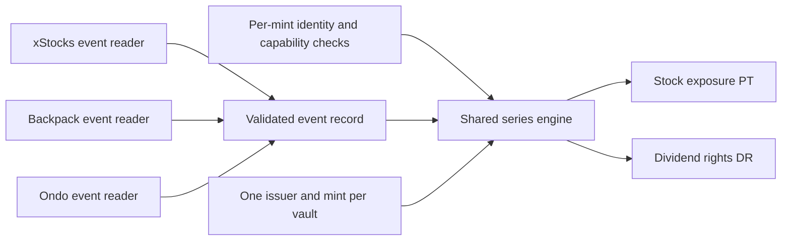

# Issuer handling and shared vault architecture

Decision: 16 September 2026, after the user expanded the hackathon to Solana's tokenized-stock issuers. This supersedes the earlier xStocks-only decision, preserved in `archive/xstocks-only-2026-09-16/`. Architecture and integration targets below are not implemented functionality.

## Decision

Build **one dividend layer for selected stock tokens on Solana**, with xStocks, Backpack/Trek and Ondo in the initial integration scope. The user's latest refinement excludes permissioned holder/approved-vault products, their onboarding and their discovery UI. The wider audit remains research only. Defer other-chain custody and bridging. Ondo's native Solana tokens belong in this phase even though its other deployments do not.

A small issuer adapter boundary is now justified by actual differences in event APIs, decimals, provenance and custody rules. The three main families use Token-2022 Scaled UI Amount, so they can share the same raw-collateral allocation algorithm for isolated reinvested dividends. We do not need three vault programs, an arbitrary plugin framework or a third circulating wrapper token.

**Admission is per asset.** A mint's presence on Solana does not establish that a vault can hold it, identify its dividend, or deliver its proceeds. Use the [selected asset package](research/initial-asset-package.md), admitting only the ordinary secondary-transfer/reinvestment model. Restricted registered shares, tokens without dividend rights, and discontinued products are outside scope.

**Permissionless protocol access:** no DividendX holder allowlist, KYC flow, approved-holder claims, or issuer-specific custody registration. A curated mint/event policy is compatible with this access model. Direct issuance/redemption onboarding remains outside the vault flow; issuer controls and product restrictions still apply. Mint configuration alone does not establish legal eligibility or prove PDA execution. If ordinary vault custody requires issuer approval, exclude that asset instead of building a permissioned integration.

## Layers



The reader and observer run offchain. The program validates the series identity, signer, event scope, chain time and observed mint state. Event classification remains an explicitly trusted input. A common interface does not make an unverified source authoritative.

| Component | Responsibility | Minimal implementation |
|---|---|---|
| Asset manifest | Official issuer/mint provenance, chain, token program, decimals, economic rights, supported extensions and authorities, current eligibility reasons | Versioned data and ordinary typed records; no auto-enrollment from ticker or registry presence |
| Issuer reader | Fetch and normalize issuer-specific actions, revisions, factor history, timing and evidence | Separate xStocks, Backpack and Ondo modules; keyed access stays server-side |
| Token capability checks | Validate exact mint, effective Scaled UI Amount, pause/freeze/hook/fee policy and account transfer requirements | Shared Token-2022 helpers plus pinned per-series policy |
| Series engine | Custody, deposit cutoff, paired issuance, locked raw pools, claim burns, independent redemption and recovery | One program; separate vault and PT/DR mints per issuer/mint/event |
| SDK/UI | Same amount model, allocation preview, provenance, status and transaction contract across issuers | Shared types and exact arithmetic; issuer/source-specific labels only where useful |

No arbitrary external adapter CPI dispatch. Any onchain configuration is fixed within the existing series state, including rules version and allowed attestor. A manifest is an offchain integration catalog, not a new token or an unaudited runtime plugin registry.

## Asset and event contract

Each asset descriptor includes `issuerId`, legal/product identity, Solana mint, token program, decimals, metadata/source URL, accounting model, extension/authority fingerprint, custody policy, settlement denomination and dated evidence. Ticker is a display field, never identity. KOx and KOon remain distinct collateral, risks and markets.

Store eligibility as separate dimensions: official mint recognized; mint observed; dividend rights documented; ordinary vault custody and claim transfer policy accepted; event source usable; deposit/redemption tested; event allocation tested; live series enabled. Discovery or passing a fixture must never set the final dimension implicitly. Only selected candidate assets appear in the product directory. Broader excluded families stay in research, with no onboarding UI or adapter stub.

An event record binds chain and mint, issuer, event ID/revision, evidence kind (`issuer_api`, `onchain_reconstruction` or `synthetic_test`), action classification, original issuer effective time, observation time/slot, prior and next effective factors, split factor, net dividend factor, source digest, finality/revision policy and authorized attestor. Keep gross/net cashflow and reinvestment price when provided; missing fields stay missing. Freeze the accepted revision per settled series. Historical replay additionally stores the original provenance and separate test activation time.

The shared engine currently admits only `ScaledReinvestmentV1` with isolated supported cash-dividend events. Cash paid to a broker account, a NAV price increase, a restricted shareholder distribution or a price-only synthetic cannot be coerced into that model. Record other models as unsupported; do not implement speculative cash-distribution or NAV settlement engines in this sprint.

## Raw allocation and claims

Deposits and redemptions use integer raw base units. For the initial model, one deposited base unit mints one unit of each paired claim. Claim units are unscaled. Internal shares normalize custody without circulating as a third redeemable asset.

For deposited raw quantity `Q` and verified isolated dividend factors `M0`, `M1`:

```
DR_pool = floor(Q × (M1 - M0) / M1)
PT_pool = Q - DR_pool
```

Use exact canonical arithmetic with bounded precision and the same conversion rules in SDK/program. Do not use JavaScript floating-point amounts as the balance ledger. A potential generalized dividend factor is `d = (M1/M0)/splitFactor`, but mixed corporate actions require their own reviewed rules and are not enabled by writing that formula down. Pure splits and reverse splits generate no dividend yield and are rejected as dividend settlements in this version.

Pin the series baseline before the intended event, close deposits before its cutoff/activation exclusion window, and reject any intervening factor change. Do not admit late deposits or combine cohorts with different embedded dividends. Today's deposit cannot capture a dividend already embedded in today's token.

At settlement, freeze raw PT/DR pools once. Later multiplier changes do not recalculate their shares. Redeemed or unredeemed underlying still carries later stock returns, so this is an event allocation paid in stock tokens, not permanently isolated cash. PT does not protect dollar principal, and DR retains price exposure on its allocated tokens. Donation handling, rounding/dust, partial redemptions and order independence must be explicit in the implementation specification.

## Custody and issuer controls

Before issuance and redemption, recheck the required token/account conditions. Recognize paused/frozen collateral, non-null hooks, transfer fees, issuer delegates and authority changes; fail according to a documented policy, not a generic transfer assumption. Current null hooks do not prove future null hooks. A freeze or seizure can prevent the program from honoring otherwise valid claims.

The initial profile requires ordinary nonconfidential transfers, no transfer fees, no active transfer hook and custody accounts able to send and receive. Accepting a permanent delegate is an explicit collateral risk, not a reason to assume the program controls the issuer. A confidential-transfer extension's presence alone is not the same as requiring confidential transfers.

Superstate-style registered shares and other products requiring holder or vault approval are excluded. Do not implement a permissioned custody path or issue claims around their restrictions. No claim of legal compatibility follows from a successful token instruction.

Per-series collateral remains isolated. Shared UI, code and settlement currency do not make different issuer claims fungible or guarantee shared liquidity. The user's 16 September product review extends the hackathon target beyond the seeded sale: actual transferable PT/DR and one verified external AMM liquidity round trip are now in scope. Choose a compatible claim mint standard and pool type explicitly; pool availability and liquidity are not implied by having a mint. LP holders must withdraw their liquidity to recover claims before redeeming them. There is no cross-issuer collateral substitution.

## Event failure and recovery

Missing, stale, contradictory or unclassified events disable new series and block settlement. Existing owners need a defined recovery path. Paired PT+DR recombination can return the corresponding collateral before final allocation under explicit rules; it cannot let an original depositor withdraw after selling DR. If owners separate, neither may unilaterally consume the other's backing. Freeze/failure and expiry resolution need specification before real deposits.

Do not label an issuer record final merely because it is the latest response. xStocks' KOx record remains `Initial`; Ondo history access and event classification must be joined; Backpack's event ledger is unresolved, although MU now has a fully bracketed onchain reconstruction. A prototype attestor can sign a sourced replay fixture, with that trust disclosed. It cannot turn missing source data into a verified historical dividend.

## Backpack event boundary

MU's observed `DividendDistribute` operation sets M0=1 to M1=`1.000106726714702`. Later ordinary mint/redeem operations move the multiplier again. The Backpack reader must distinguish those operations, capture exact transaction/instruction boundaries and preserve the fully covered authority-history bracket. Never use today's multiplier as the historical event factor. The prototype can attest this frozen record as an **onchain reconstruction**, not an issuer-published final event ledger. Program/IDL provenance, revision/correction semantics and future eligibility/cutoff timing still need Backpack confirmation.

An unexpected non-dividend factor change after a series baseline blocks the current settlement path until explicitly resolved; do not silently classify it as income. Supporting recurrent supply-maintenance adjustments requires a reviewed neutral-adjustment rule with conservation tests. The isolated MU replay does not establish that continuous live handling already works. See [Backpack audit](research/backpack-solana.md).

## Day-one proof and scope

Initial coverage is a bounded package across xStocks, Backpack and Ondo, with one execution target per family and a small set of additional stocks reusing those readers. Prove independent deposit/claim/redemption behavior against representative test mints with their real decimal/extension profiles. These tests establish code portability, not actual issuer integration.

For event execution, each named issuer needs a sourced event record and accepted semantics. Preserve the verified KOx historical replay as the complete reference flow. Add MU's sourced `onchain_reconstruction` replay using its frozen transaction/history evidence, and an Ondo real-event replay when the classified event contract is satisfied. Otherwise expose dated observation and the concrete missing capability. Never silently demote the product back to an xStocks-only architecture or inflate an observation page into a completed integration.

A live series additionally requires a future event, tested permitted custody/transfer behavior, finality/correction rules and an operational signer. No production readiness or mainnet transaction has been established. One external AMM path is now a hackathon target after the vault; other networks, an extra wrapper token, a custom AMM, leverage, staking rewards and automatic USDC conversion remain later work.

## Pendle comparison

Pendle's [Standardized Yield](https://docs.pendle.finance/pendle-v2-dev/Contracts/StandardizedYield) is the useful precedent: normalize assets before splitting claims. Here, internal vault shares plus issuer readers provide the needed boundary. Equity-specific work is classifying corporate actions and handling issuer permissions, rather than claiming Pendle cannot handle rebasing assets. A transferable wrapper becomes justified only when another consumer needs it; it must be burned or escrowed when issuing PT/DR to prevent duplicate claims.
