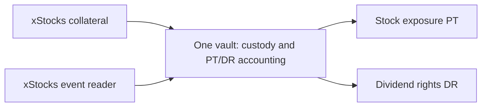

# Issuer handling and the first usable product

Decision: 16 September 2026, following user review. Architecture direction, not implemented functionality.

**The decision**

Keep the hackathon implementation as a simple xStocks vault. Separate its data reader and token checks from the PT/DR allocation functions using ordinary modules. In this document, "adapter" means that small implementation boundary; it does not mean a generic multi-issuer framework, extra deployed program, extra adapter account or additional transaction. Use internal vault shares for the MVP. Defer a formal issuer interface and any separately transferable wrapper token until a second verified integration needs them.

This narrows the earlier adapter proposal after the user's complexity review. One issuer, one mint and one supported event remain the delivery scope. Shared token mechanics may allow reuse across issuers, but mint identity, event evidence and supported extensions still need separate validation. Do not build speculative normalization for future issuers now.

Pendle's [Standardized Yield wrapper](https://docs.pendle.finance/pendle-v2-dev/Contracts/StandardizedYield) normalizes deposit, redemption and exchange-rate behavior, while its [yield-tokenization layer](https://docs.pendle.finance/pendle-v2-dev/Contracts/YieldTokenization) issues PT/YT and accounts for yield. Our proposed design borrows that separation. A generic exchange rate alone is insufficient for equities because [xStocks' multiplier](https://docs.xstocks.fi/developers/multipliers) includes both dividends and splits.

The reader runs offchain. Token checks and allocation are ordinary functions within the vault implementation; the diagram does not imply an additional deployed adapter layer.

**What each layer owns**

| Layer | Responsibility |
|---|---|
| Issuer observer | Fetch asset metadata and action records; retain source times, IDs and revisions; reconcile them with onchain mint state |
| xStocks reader and token helpers | Understand raw units, decimals, current/pending multipliers, supported token extensions and action types; construct the event record |
| Program validation and custody | Bind the series to its exact mint and accounting-rules version; validate balances, time, signer and mint evidence; hold collateral in the series PDA |
| Shared series engine | Deposit cutoff, internal shares, paired PT/DR minting, one-time allocation, burns, withdrawals and collateral conservation |
| Frontend/SDK | Present user amounts and provenance; call the same accounting logic for previews and transactions |

The observer runs offchain. Its classification is a trusted attestation, not a fact the program can infer solely from the multiplier. The onchain program validates what it can observe and enforces the attestation's allowed shape and scope. An offchain interface by itself does not make future collateral safe or supported.

**MVP records, exact units**

Freeze these meanings before program implementation:

- **Asset identity:** issuer provenance, chain, mint, token program, decimals, accounting-rules version and supported extension policy. The MVP has no runtime issuer selector.
- **Collateral conversion:** raw base units deposited/withdrawn and internal share units. For the initial xStocks series, one raw base unit mints one internal share unit. Displayed stock equivalents are derived separately.
- **Observation:** effective multiplier, pending multiplier/time, observed slot/time and source freshness.
- **Normalized event:** event ID/revision, action type, issuer effective time, observed evidence, multiplier before/after, separate split and dividend factors, supported settlement asset and attestor signature.
- **Allocation:** fixed raw principal and dividend pools, integer precision and dust rule. Stock-market prices do not determine the dividend factor.

Implement xStocks-specific validation as ordinary functions in the vault program. Do not build a generic trait hierarchy, adapter registry, separate adapter program/account or arbitrary external program dispatch. A series pins its rules version and mint for its lifetime. Keep collateral isolated by series, even when two series use the same ticker. Internal shares are accounting units, not a third token or a second deposit step.

If a later issuer distributes cash directly, charges transfer fees, or has different corporate-action semantics, design and review that integration when it is actually in scope. Do not force it into the xStocks formula. Unsupported behavior must stop settlement or issuance according to the series rules.

**Why defer another token**

Users can deposit xStocks and receive PT/DR in one atomic flow without holding an intermediate wrapper token. Internal shares provide a normalization boundary without creating a third circulating claim.

If a transferable wrapper is introduced later, its shares must be burned or escrowed when PT/DR are issued. A user must never retain a redeemable wrapper and two independently redeemable claims against the same collateral. A wrapper becomes useful when another protocol consumes it directly, or multiple products need portable collateral shares. Those needs are not established for this MVP.

**Future issuers**

Backpack, Ondo and other issuers require verification of their exact token implementation, entitlements and event data. Reuse the scaled-amount reader and allocation functions when those semantics match; add only the issuer-specific data translation and validation that the evidence requires. Identical token extensions alone do not establish identical settlement inputs. A new integration remains outside the hackathon critical path. Coinbase or another issuer on a different chain also requires a deployment or bridge design. Code separation does not make a Solana program able to custody assets on another chain. Claims from different issuers remain distinct even when they reference the same stock.

**Backpack finding, 16 September 2026**

Backpack's [Micron announcement](https://learn.backpack.exchange/blog/tokenized-micron-mu) identifies its official Solana mint and confirms reinvestment of dividends. Inspection of that mint confirms Token-2022 `scaledUiAmountConfig`, the same balance primitive used by xStocks. MU uses six decimals, so reuse must remain parameterized by the actual mint. The shared primitive supports code reuse; it does not identify whether a multiplier change was a dividend, split or another event.

Backpack brokerage holdings and withdrawn Backpack-issued tokens have different dividend delivery: cash through brokerage infrastructure versus reinvestment for tokenized securities. A stock's presence in the exchange catalog does not establish current token withdrawal availability. Read [backpack-research.md](backpack-research.md) for the dated API/RPC evidence and remaining integration gaps. A Backpack implementation is deferred until a sourced dividend event, transfer compatibility and issuer-specific timing/revision rules are verified. This preserves the simple xStocks delivery scope while leaving useful code reusable.

**Useful on the first release**

Ship a working KOx asset page alongside the vault demonstration: current mint and multiplier, recent real actions with source links, gross/net issuer figures, and a reproducible principal/dividend allocation for an entered balance. This gives holders and integrators a useful explanation of the token's behavior immediately.

An entered balance is a scenario. Today's wallet balance does not prove what the wallet held before a past action. Historical entitlement claims require balances at the event cutoff and the correct event record. The calculator must never label a scenario as a dividend the user actually earned.

Replay the real event through the actual program using a mock underlying, preserving its economic parameters and provenance. Only the clock, test collateral and seeded trading activity are controlled. A compressed replay stores both the original event time and the test execution time. Signing and validation rules remain equivalent to the live path; the normalizer and allocation engine are shared.

A production path must take its starting snapshot before a future event. Today's deposit cannot strip a dividend already embedded in today's token. A capped live series can be considered once transfer compatibility, future event data, correction/finality rules and operating requirements are verified. Historical replay remains the delivery baseline and does not imply these gates passed.

**Verification changes the design**

At each phase, record evidence, what changed, the affected specification/UI/pitch and the next validation step in `decision-log.md`. Update the master plan and work orders before handoff. Preserve original source snapshots; add new observations rather than overwrite them. Separate direct observations, interpretations and unresolved assumptions. Passing tests against a fixture proves code behavior, not issuer data quality or production readiness.
